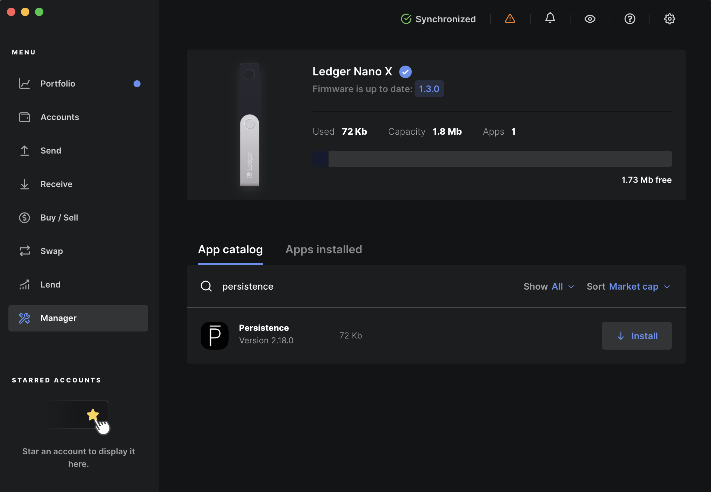
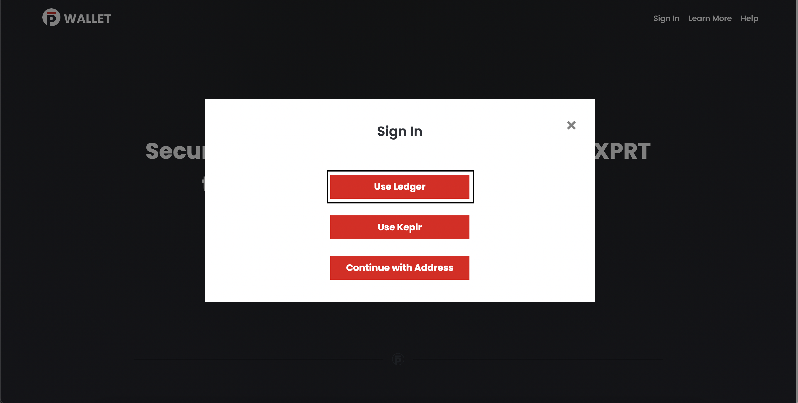
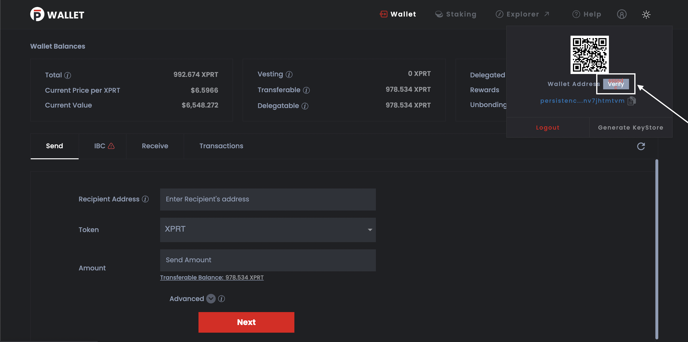

# Ledger Nano Support

Using a hardware wallet to store your keys comes handy and improves the security of your crypto assets. The **Ledger** device acts as an enclave of the seed phrase (mnemonic) and private keys and thereby the process of signing transaction takes place within it. Your private information is secure and will not leak from the Ledger device. Here is a short tutorial on using the **Persistence Ledger** app with the **PersistenceCore CLI**.    

At the core of a **Ledger** device there is a mnemonic (seed phrase) that is used to generate private keys. The seed phrase is generated when you initialize your **Ledger**. The mnemonic is compatible with **Persistence** and can be used to seed new accounts.

::: danger
Do not lose or share your 24 words seed phrase with anyone. To prevent theft or loss of funds, it is best to keep multiple copies of your mnemonic stored in a safe and secure location. Please be aware that if someone gains access to your mnemonic, they can fully control your associated accounts.
:::

## Install the Persistence Ledger application

Installing the **Persistence** application on your ledger device is required before you use [`persistenceCore`](#persistencecore-cli-+-ledger-nano). To do so, you need to:

1. Install [Ledger Live](https://shop.ledger.com/pages/ledger-live) on your machine.
2. Using Ledger Live, [update your Ledger Nano S with the latest firmware](https://support.ledger.com/hc/en-us/articles/360002731113-Update-device-firmware). On the Ledger Live application, navigate to the **Manager** menu .
   
4. Connect your **Ledger Nano** device and select the **Allow Ledger Manager on your device** check box.
5. On the **Ledger Live** application, search for **Persistence**.
6. Install the **Persistence** application by clicking **Install**.
   

## Persistence Wallet + Ledger Nano
    
You can sign into your Persistence Wallet and do all transactions using the Ledger Nano device without having the need to use your private key or mnemonic.

Prerequisites: [Install the Persistence app](#install-the-persistence-ledger-application) on your Ledger Nano before doing the following task.    
1. After connecting your Ledger device to the computer, unlock it with the PIN and open the Persistence Wallet app on your Ledger device.    
2. Open the [Persistence Wallet](https://wallet.persistence.one/) in your web browser.    
3. Select **Sign in** on the web wallet.
   
4. You can now use Persistence Wallet with your Ledger Nano.   

**Note**: When you transact on Persistence Wallet (Send or Stake), you need to confirm the transaction on your Ledger device. An indication is displayed on your Persistence Wallet app to approve or reject the transaction.

### Confirm Address on ledger
Once logged in, you can verify the logged in address with the address on the ledger device by clicking the verify button.   
   

## PersistenceCore CLI + Ledger Nano

**Note: You need to [install the Persistence app](#install-the-persistence-ledger-application) on your Ledger Nano before using following this section**

The tool used to generate addresses and transactions on the Persistence is **persistenceCore**. Here is how to get started.   

### Before you Begin

- [Install Golang](https://golang.org/doc/install)
- [Install PersistenceCore](https://github.com/persistenceOne/persistenceCore#installation-steps)

Verify that **persistenceCore** is installed correctly with the following command

```bash
persistenceCore version --long

➜ name: persistenceCore
server_name: persistenceCore
version: 0.1.3-2-gebc7dc7
commit: ebc7dc7
build_tags: netgo,ledger
go version go1.14.5 darwin/amd64
```

### Add your Ledger key

1. Connect and unlock your Ledger device.
2. Open the Persistence app on your Ledger.
3. Create an account in persistenceCore from your ledger key.

::: tip
Ensure that you change the _keyName_ parameter to a meaningful name so that you can identify it with ease. The **Ledger** flag indicates **persistenceCore** to use your Ledger to seed the account.
   :::

```bash
persistenceCore keys add <keyName> --ledger

➜ NAME: TYPE: ADDRESS:     PUBKEY:
<keyName> ledger persistence1... persistencepub1...
```

Persistence uses HD wallets. This means you can setup many accounts using the same Ledger seed. To create another account from your Ledger device, run (change the integer i to some value >= 0 to choose the account for HD derivation):

```bash
persistenceCore keys add <secondKeyName> --ledger --account <i>
```

### Confirm your address

Run this command to display your address on the device. Use the **keyName** that you gave on your ledger key. The -d flag is supported in version 1.2.0 and higher.

```bash
persistenceCore keys show <keyName> -d
```

Confirm that the address displayed on the device matches the one that's displayed when you added the key.

### Connect to a full node

Next, you need to configure persistenceCore with the URL of a Persistence full node and the appropriate **chain_id**. In this example, we connect to the public load balanced full node operated by Persistence on the **core-1** chain. But you can point your persistenceCore to any Persistence full node. Be sure that the chain-id is set to the same chain as the full node.

Test your connection with a query such as:

``` bash
persistenceCore query staking validators --node https://rpc.core.persistence.one:443 --chain-id core-1
```

::: tip
To run your own full node locally [read more here.](https://github.com/persistenceOne/persistenceCore#initialize-a-new-chain-and-start-node).
:::

### Sign a transaction

You are now ready to start signing in and sending transactions. Send a transaction with persistenceCore using the the **tx send** command.

``` bash
persistenceCore tx send --help # to see all available options.
```

::: tip
Ensure that you unlock your device with the PIN and then open the **Persistence** app before trying to run these commands
:::

Use the **keyName** you set for your Ledger key and persistenceCore will connect with the Persistence Ledger app to then sign your transaction.

```bash
persistenceCore tx send <keyName> <destinationAddress> <amount><denomination> --node https://rpc.core.persistence.one:443 --chain-id core-1
```

When prompted with `confirm transaction before signing`, Answer `Y`.

Next, you are prompted to review and approve the transaction on your Ledger device. Be sure to inspect the transaction JSON displayed on the screen. You can scroll through each field and each message. Scroll down to read more about the data fields of a standard transaction object.

Now, you are all set to start sending transactions on the network

### Receive funds

To receive funds to the Persistence account on your Ledger device, retrieve the address for your Ledger account (the ones with `TYPE ledger`) with this command:

```bash
persistenceCore keys list

➜ NAME:   TYPE:  ADDRESS:        PUBKEY:
<keyName> ledger persistence1... persistencepub1...
```

### Further documentation

Not sure what `persistenceCore` can do? Simply run the command without arguments to output documentation for the commands in supports.

::: tip
The **persistenceCore** help commands are nested. So `$ persistenceCore` will output docs for the top level commands (status, config, query, and tx). You can access documentation for sub commands with further help commands.

For example, to print the **query** commands:

```bash
persistenceCore query --help
```

Or to print the **tx** (transaction) commands:

```bash
persistenceCore tx --help
```
:::

## The Cosmos Standard Transaction

Transactions in Persistence embed the [Standard Transaction type](https://godoc.org/github.com/cosmos/cosmos-sdk/x/auth#StdTx) from the Cosmos SDK. The Ledger device displays a serialized JSON representation of this object for you to review before signing the transaction. Here are the fields and what they mean:

- `chain-id`: The chain to which you are broadcasting the tx, such as the `test-core-1` testnet or `core-1`: mainnet.
- `account_number`: The global id of the sending account assigned when the account receives funds for the first time.
- `sequence`: The nonce for this account, incremented with each transaction.
- `fee`: JSON object describing the transaction fee, its gas amount and coin denomination
- `memo`: optional text field used in various ways to tag transactions.
- `msgs_<index>/<field>`: The array of messages included in the transaction. Double click to drill down into nested fields of the JSON.

## Support

For any questions or support, do reach us out on our [Telegram channel](https://t.me/PersistenceOneChat).
